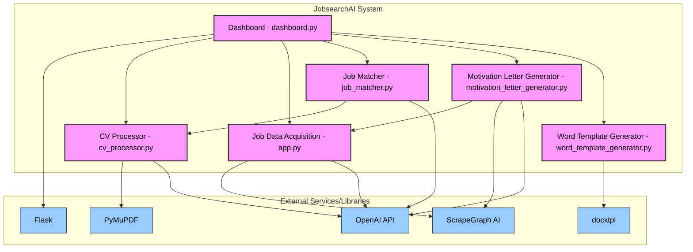

# JobsearchAI System Overview

**Purpose**: The JobsearchAI system automates and enhances the job application process by intelligently scraping job listings, matching them against candidate CVs, and generating personalized application documents.

## System Workflow & Data Flow

The system operates through a series of interconnected components, primarily managed via a Flask web dashboard:

1.  **CV Processing**:
    *   User uploads a CV (PDF) via the dashboard (`process_cv/cv-data/input/`).
    *   The `CV Processor` (`process_cv/cv_processor.py`) extracts text using PyMuPDF.
    *   OpenAI (`gpt-4.1`) summarizes the CV text based on a detailed prompt, focusing on career trajectory, preferences, goals, etc.
    *   The summary is saved to `process_cv/cv-data/processed/{cv_filename}_summary.txt`.

2.  **Job Data Acquisition**:
    *   User initiates scraping via the dashboard.
    *   The `Job Data Acquisition` component (`job-data-acquisition/app.py`) uses ScrapeGraph AI (configured via `job-data-acquisition/settings.json`) to scrape job listings from specified URLs (e.g., ostjob.ch).
    *   It iterates through pages (up to `max_pages` defined in settings) and uses OpenAI (`gpt-4.1` or as configured) to extract structured job details (Title, Company, Description, Skills, etc.).
    *   Results (potentially a list of lists, one per page) are saved to a timestamped JSON file in `job-data-acquisition/job-data-acquisition/data/`.

3.  **Job Matching**:
    *   User selects a processed CV and initiates matching via the dashboard.
    *   The `Job Matcher` (`job_matcher.py`) loads the selected CV summary and the latest job data JSON file.
    *   For each job listing (up to `max_jobs`), it uses OpenAI (`gpt-4.1`) to evaluate the match based on multiple criteria (Skills, Experience, Location, Education, Career Trajectory, Preferences, Satisfaction) defined in a detailed prompt, forcing JSON output.
    *   Matches are filtered by a minimum score (`min_score`) and sorted.
    *   The top matches (up to `max_results`), including the evaluation details and the path to the CV used, are saved to timestamped JSON and Markdown files in the `job_matches/` directory.

4.  **Motivation Letter Generation**:
    *   User selects one or more matched jobs from the results page on the dashboard.
    *   The `Motivation Letter Generator` (`motivation_letter_generator.py`) retrieves the relevant CV summary and job details.
    *   It attempts to get up-to-date job details using ScrapeGraph AI directly from the job URL, falling back to the pre-scraped data if necessary.
    *   It uses OpenAI (`gpt-4.1`) with a detailed prompt (including CV summary and job details) to generate a personalized motivation letter, requesting a specific JSON structure.
    *   The generated letter is saved as both JSON and HTML files in the `motivation_letters/` directory, using a sanitized job title in the filename.

5.  **Word Document Generation**:
    *   User requests a Word version of a generated motivation letter via the dashboard.
    *   The `Word Template Generator` (`word_template_generator.py`) uses the `docxtpl` library.
    *   It loads the corresponding motivation letter JSON file.
    *   It populates a Word template (`motivation_letters/template/motivation_letter_template.docx`) with the data from the JSON file using Jinja2 syntax.
    *   The resulting `.docx` file is saved in the `motivation_letters/` directory, typically mirroring the JSON filename.

6.  **Dashboard Interface**:
    *   The Flask application (`dashboard.py`) provides the central user interface.
    *   It allows users to manage files (upload CVs, view/delete CVs, job data, reports, letters).
    *   It triggers the execution of the different components (scraping, matching, letter generation), often using background threads (`threading`) for long-running tasks.
    *   It displays results (job matches, generated letters, job data contents).
    *   It provides progress tracking for background operations via AJAX polling.

## Core Components Summary

*   **CV Processor (`process_cv/`)**: Extracts text from PDF CVs and uses AI to generate structured summaries focusing on career aspects. Requires OpenAI API key.
*   **Job Data Acquisition (`job-data-acquisition/`)**: Scrapes job listings from web pages using ScrapeGraph AI and saves structured data to JSON files. Configured via `settings.json`. Requires OpenAI API key (or other LLM config).
*   **Job Matcher (`job_matcher.py`)**: Compares CV summaries against scraped job listings using AI evaluation to score and rank potential matches. Outputs JSON and Markdown reports. Requires OpenAI API key.
*   **Motivation Letter Generator (`motivation_letter_generator.py`)**: Creates personalized motivation letters using AI, combining CV summary and job details (obtained via direct scraping or pre-scraped data). Outputs JSON and HTML letters. Requires OpenAI API key.
*   **Word Template Generator (`word_template_generator.py`)**: Converts structured JSON motivation letters into formatted Word documents using a template and `docxtpl`.
*   **Dashboard (`dashboard.py`)**: Flask web application providing the user interface to manage files, run processes, view results, and track progress. Orchestrates the interaction between components.

## Key Technologies

*   **Backend**: Python, Flask
*   **AI/LLM**: OpenAI GPT models (specifically `gpt-4.1` used in several components), ScrapeGraph AI
*   **Web Scraping**: ScrapeGraph AI, PyMuPDF (for PDF text extraction)
*   **Document Generation**: `docxtpl`, `python-docx`
*   **Frontend**: HTML, CSS, JavaScript, Bootstrap 5 (assumed)
*   **Data Format**: JSON
*   **Concurrency**: Python `threading` (for background tasks in dashboard)
*   **Configuration**: `.env` files, JSON (`settings.json`)

## Setup & Configuration

*   **API Keys**: An OpenAI API key is required for the CV Processor, Job Matcher, and Motivation Letter Generator. It's typically loaded from `process_cv/.env`.
*   **Job Scraper Settings**: The `job-data-acquisition/settings.json` file configures target URLs, LLM details for scraping, logging, output directories, and scraping parameters like `max_pages`.
*   **Word Template**: The `motivation_letters/template/motivation_letter_template.docx` file serves as the base for generated Word documents.
*   **Dependencies**: Python dependencies are listed in `requirements.txt` (and potentially `job-data-acquisition/dependencies.txt`). Key libraries include `Flask`, `openai`, `python-dotenv`, `scrapegraphai`, `pymupdf`, `docxtpl`.

## Running the System

The primary way to interact with the system is through the Flask dashboard:

1.  Ensure all dependencies are installed (`pip install -r requirements.txt`).
2.  Make sure the necessary configuration files (`.env`, `settings.json`) are present and correctly configured.
3.  Run the dashboard application: `python dashboard.py`
4.  Access the dashboard in your web browser (typically at `http://127.0.0.1:5000`).
5.  Use the dashboard interface to upload CVs, run the scraper, run the matcher, and generate letters.

## Component Dependency Graph

This diagram illustrates the primary code dependencies between the system's components and key external libraries/services. The Dashboard acts as the central orchestrator, calling functions from the other modules.

**Notes:**
*   Arrows indicate a dependency (e.g., `DASH --> CVPROC` means the Dashboard calls functions from the CV Processor).
*   Data file dependencies (reading/writing JSON, TXT, DOCX, MD files) are described in the "System Workflow & Data Flow" section above and are not explicitly shown in this code dependency graph for clarity.
