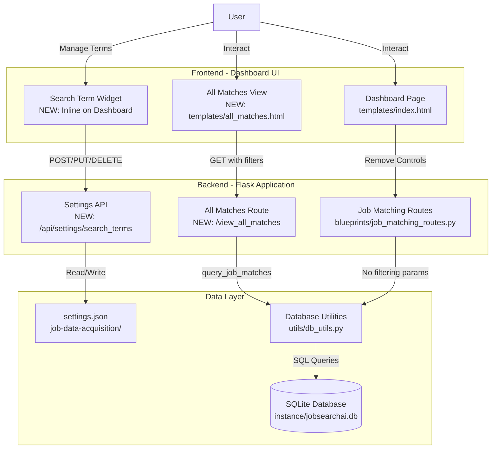
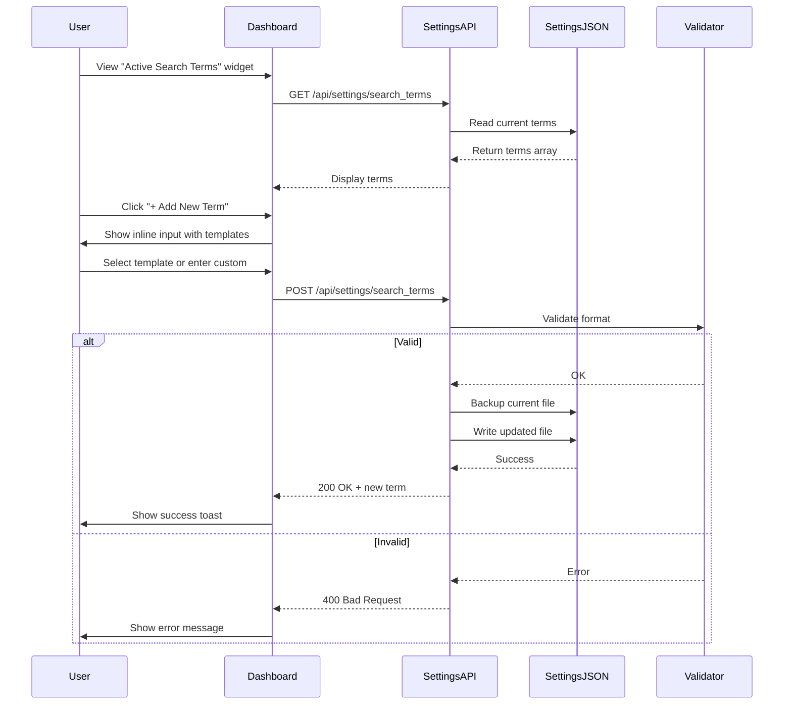

# UX Improvements Architecture Document
## Post-SQLite Deduplication UI/Configuration Enhancements

**Document Type:** Focused Architecture Specification  
**Project:** JobSearchAI UX Improvements  
**Version:** 1.0  
**Date:** 2025-11-02  
**Architect:** Winston (System Architect)  
**Status:** Ready for Implementation  
**Based On:** Top 3 Priority Ideas from Brainstorming Session Results

---

## 📋 Table of Contents

1. [Executive Summary](#executive-summary)
2. [Introduction](#introduction)
3. [High Level Architecture](#high-level-architecture)
4. [Priority 1: Remove Superfluous UI Controls](#priority-1-remove-superfluous-ui-controls)
5. [Priority 2: Quick Add Search Terms Widget](#priority-2-quick-add-search-terms-widget)
6. [Priority 3: Unified Job Report View](#priority-3-unified-job-report-view)
7. [Tech Stack & Dependencies](#tech-stack--dependencies)
8. [Project Structure Changes](#project-structure-changes)
9. [Development Workflow](#development-workflow)
10. [Testing Strategy](#testing-strategy)
11. [Deployment Strategy](#deployment-strategy)
12. [Success Metrics](#success-metrics)

---

## 📊 Executive Summary

### Context

The JobSearchAI system recently completed SQLite deduplication implementation (Epic 2), which fundamentally changed how job data is stored and queried. However, the user interface still reflects the old file-based architecture, creating confusion and suboptimal user experience.

### Problem Statement

**Three critical UX issues identified:**

1. **Misleading UI Controls**: Forms still show "Minimum Match Score" and "Max Results" inputs that no longer affect system behavior
2. **Configuration Barrier**: Search terms require manual JSON file editing, blocking non-technical users
3. **Fragmented Data View**: Job matches shown as individual report files instead of leveraging SQLite query capabilities

### Solution Overview

This architecture document defines the implementation of three focused improvements:

**Priority #1: Remove Superfluous UI Controls (0.5 days)**
- Clean removal of non-functional form inputs
- Add helpful user guidance
- Align UI with actual system behavior

**Priority #2: Quick Add Search Terms Widget (1-2 days)**
- Inline search term management on dashboard
- Built-in validation and templates
- AJAX/API-based updates to settings.json

**Priority #3: Unified Job Report View (2-3 days)**
- SQLite-powered job matching interface
- Dynamic filtering (search term, score, date, location)
- Pagination and sorting capabilities
- Replace file-based report list

### Expected Impact

| Metric | Current | Target | Timeline |
|--------|---------|--------|----------|
| User Confusion | High (misleading controls) | Eliminated | Week 1 |
| Configuration Accessibility | Technical users only | All users | Week 1-2 |
| Data Query Flexibility | None (static files) | Full SQL filtering | Week 2-3 |
| UI Consistency | Mismatched with backend | Fully aligned | Week 3 |

---

## 🎯 Introduction

### Purpose

This document provides detailed architectural specifications for implementing the Top 3 Priority UX improvements identified in the brainstorming session. It serves as the definitive guide for AI-driven development agents and human developers implementing these enhancements.

### Scope

**In Scope:**
- Frontend UI modifications (templates, forms, widgets)
- Backend route additions (API endpoints for configuration and querying)
- Database query integration (leveraging existing SQLite schema)
- Configuration management (settings.json updates)
- User guidance and documentation

**Out of Scope:**
- Database schema changes (already complete in Epic 2)
- Scraper modifications (handled in Epic 2)
- Matcher deduplication logic (handled in Epic 2)
- Advanced features (saved searches, ML analytics, multi-site aggregation)

### Project Context

**Foundation:**
- SQLite database with `job_matches` table (Epic 2, completed)
- Existing query functions in `utils/db_utils.py`
- Flask-based dashboard with Jinja2 templates
- Blueprint-based routing architecture

**Key Assumption:**
All improvements build on the completed SQLite foundation. No database schema changes required.

### Related Documents

- [Brainstorming Session Results](brainstorming-session-results.md) - Source of Top 3 priorities
- [Unified Architecture Document](../System%20A%20and%20B%20Improvement%20Plan/UNIFIED-ARCHITECTURE-DOCUMENT.md) - SQLite foundation
- [System B SQLite Integration Changes](../System%20A%20and%20B%20Improvement%20Plan/System%20B%20SQLite%20Integration%20Changes.md) - Database integration details

---

## 🏗️ High Level Architecture

### System Context Diagram



### Architectural Changes Overview

**Priority #1: UI Cleanup**
```
BEFORE: Form with min_score + max_results inputs
AFTER:  Clean form + info message about filtering in results view
```

**Priority #2: Configuration Management**
```
BEFORE: Manual editing of settings.json
AFTER:  Dashboard widget → API endpoint → settings.json (with validation)
```

**Priority #3: Data Access**
```
BEFORE: List of timestamped JSON files → Click to view individual report
AFTER:  Single "View All Matches" → Filter panel → Paginated results from SQLite
```

### Integration Points

| Component | Integration Type | Direction | Details |
|-----------|------------------|-----------|---------|
| Dashboard → Settings API | REST API | Frontend → Backend | AJAX calls for search term CRUD |
| All Matches View → Database | Query API | Frontend → Backend → DB | Filter parameters passed to query function |
| Form Removal | Template Modification | Frontend only | No backend changes needed |
| Settings JSON | File I/O | Backend → Filesystem | Atomic write with backup |

---

## 🎯 Priority 1: Remove Superfluous UI Controls

### Problem Analysis

**Current State:**
```html
<!-- templates/index.html -->
<form id="matcher-form">
    <label for="min_score">Minimum Match Score (1-10):</label>
    <input type="number" id="min_score" name="min_score" value="6" min="1" max="10">
    
    <label for="max_results">Max Results to Return:</label>
    <input type="number" id="max_results" name="max_results" value="50" min="1" max="200">
    
    <!-- This appears in TWO forms: Run Job Matcher and Run Combined Process -->
</form>
```

**Why These Controls Are Superfluous:**
1. SQLite now stores ALL matched jobs (no filtering during match phase)
2. Filtering happens in System B (dashboard query), not System A (matcher)
3. Controls give false impression that they affect matching behavior
4. Backend ignores these parameters after SQLite migration

### Target Architecture

#### Frontend Changes

**File: `templates/index.html`**

```html
<!-- REMOVE these input fields from both forms -->
<!-- OLD: -->
<label for="min_score">Minimum Match Score (1-10):</label>
<input type="number" id="min_score" name="min_score" value="6" min="1" max="10">

<label for="max_results">Max Results to Return:</label>
<input type="number" id="max_results" name="max_results" value="50" min="1" max="200">

<!-- REPLACE with helpful guidance -->
<div class="info-box">
    <i class="icon-info-circle"></i>
    <p><strong>All matching jobs are saved to the database.</strong></p>
    <p>After matching completes, you can filter results by score, date, location, and more in the <a href="/view_all_matches">All Matches View</a>.</p>
</div>
```

**Visual Design:**

```
┌─────────────────────────────────────────┐
│  Run Job Matcher                        │
├─────────────────────────────────────────┤
│                                         │
│  Select CV: [Lebenslauf.pdf ▼]         │
│                                         │
│  ╭──────────────────────────────────╮  │
│  │ ℹ️  All matching jobs are saved   │  │
│  │    to the database.               │  │
│  │                                   │  │
│  │    After matching completes, you  │  │
│  │    can filter results by score,   │  │
│  │    date, location, and more in    │  │
│  │    the All Matches View.          │  │
│  ╰──────────────────────────────────╯  │
│                                         │
│  [Run Matcher]                          │
└─────────────────────────────────────────┘
```

#### Backend Changes

**File: `blueprints/job_matching_routes.py`**

```python
# BEFORE (pseudo-code):
@bp.route('/run_matcher', methods=['POST'])
def run_matcher():
    cv_path = request.form.get('cv_path')
    min_score = int(request.form.get('min_score', 6))  # ← Remove
    max_results = int(request.form.get('max_results', 50))  # ← Remove
    
    matches = match_jobs_with_cv(cv_path, min_score, max_results)
    return render_template('results.html', matches=matches)

# AFTER:
@bp.route('/run_matcher', methods=['POST'])
def run_matcher():
    cv_path = request.form.get('cv_path')
    
    # No longer pass min_score or max_results
    # Database stores ALL matches
    matches = match_jobs_with_cv(cv_path)
    
    # Redirect to All Matches View with CV filter
    return redirect(url_for('view_all_matches', cv_key=get_cv_key(cv_path)))
```

#### Documentation Changes

**File: `docs/USER-QUICK-START-GUIDE.md`**

Add section:
```markdown
### Filtering Job Matches

After running the matcher, ALL matched jobs are saved to the database.
To filter results:

1. Navigate to "View All Matches"
2. Use the filter panel to refine:
   - Minimum match score (1-10)
   - Search term
   - Date range
   - Location
3. Sort by score, date, or company
4. Select jobs to generate motivation letters

**Note:** The matcher no longer accepts min_score or max_results parameters.
All filtering happens after matching is complete.
```

### Implementation Details

**Step 1: Template Modification**
```bash
# Files to modify:
templates/index.html  # Main dashboard with forms
```

**Changes:**
1. Remove `min_score` input from "Run Job Matcher" form
2. Remove `max_results` input from "Run Job Matcher" form
3. Remove `min_score` input from "Run Combined Process" form
4. Remove `max_results` input from "Run Combined Process" form
5. Add info box with guidance message
6. Update form submit button text if needed

**Step 2: Route Handler Cleanup**
```bash
# Files to modify:
blueprints/job_matching_routes.py
```

**Changes:**
1. Remove `min_score` parameter from `request.form.get()` calls
2. Remove `max_results` parameter from `request.form.get()` calls
3. Remove parameters from `match_jobs_with_cv()` function calls
4. Update redirect to point to All Matches View

**Step 3: Function Signature Updates**
```bash
# Files to modify:
job_matcher.py
```

**Changes:**
1. Update `match_jobs_with_cv()` signature (if parameters are removed)
2. Ensure function stores ALL matches to database
3. Remove any internal filtering logic

### Testing Requirements

**Manual Testing:**
1. ✅ Form renders without min_score/max_results inputs
2. ✅ Info box displays correctly with proper styling
3. ✅ Link to All Matches View works
4. ✅ Form submission works without parameters
5. ✅ All matches are saved to database (none filtered out)

**Unit Tests:**
```python
# tests/test_ui_changes.py
def test_matcher_form_no_filtering_inputs():
    """Verify min_score and max_results removed from form"""
    response = client.get('/')
    html = response.data.decode('utf-8')
    
    assert 'min_score' not in html
    assert 'max_results' not in html
    assert 'All matching jobs are saved' in html

def test_run_matcher_accepts_no_filtering_params():
    """Verify route doesn't require min_score/max_results"""
    response = client.post('/job_matching/run_matcher', data={
        'cv_path': 'test_cv.pdf'
        # No min_score or max_results
    })
    
    assert response.status_code in [200, 302]  # Success or redirect
```

### Success Criteria

- [ ] Both forms (Run Matcher, Run Combined) render without filtering inputs
- [ ] Info box displays with correct message and link
- [ ] Forms submit successfully without parameters
- [ ] Backend routes don't reference min_score or max_results
- [ ] All matches saved to database (verified with database query)
- [ ] User guide updated with new workflow
- [ ] All tests passing

### Rollback Plan

**If issues arise:**
1. Revert template changes (restore input fields)
2. Revert route handler changes (accept parameters again)
3. No database changes needed (backward compatible)
4. Deploy previous version

### Time Estimate

- Template modifications: 1 hour
- Route handler cleanup: 1 hour
- Testing: 2 hours
- Documentation: 1 hour
- **Total: 0.5 days**

---

## 🔧 Priority 2: Quick Add Search Terms Widget

### Problem Analysis

**Current State:**

```json
// job-data-acquisition/settings.json
{
  "urls": [
    "https://www.ostjob.ch/job/suche-IT-typ-festanstellung-pensum-80-bis-100-seite-",
    "https://www.ostjob.ch/job/suche-Data-Analyst-typ-festanstellung-pensum-80-bis-100-seite-"
  ],
  "max_pages": 10
}
```

**Pain Points:**
1. Users must manually edit JSON file
2. Risk of JSON syntax errors
3. No validation of URL format
4. No discoverability of available search patterns
5. Requires technical knowledge

### Target Architecture

#### High-Level Flow



#### Frontend Component

**New Widget: Search Term Manager**

```html
<!-- NEW SECTION in templates/index.html -->
<div class="dashboard-section" id="search-term-manager">
    <h3>Active Search Terms</h3>
    
    <div id="search-terms-list">
        <!-- Dynamically populated via JavaScript -->
        <div class="search-term-item" data-term-index="0">
            <span class="term-label">IT-typ-festanstellung-pensum-80-bis-100</span>
            <button class="btn-icon btn-edit" onclick="editSearchTerm(0)">✏️</button>
            <button class="btn-icon btn-delete" onclick="deleteSearchTerm(0)">🗑️</button>
        </div>
        <div class="search-term-item" data-term-index="1">
            <span class="term-label">Data-Analyst-typ-festanstellung-pensum-80-bis-100</span>
            <button class="btn-icon btn-edit" onclick="editSearchTerm(1)">✏️</button>
            <button class="btn-icon btn-delete" onclick="deleteSearchTerm(1)">🗑️</button>
        </div>
    </div>
    
    <div id="add-term-section">
        <button class="btn-primary" id="btn-add-term">+ Add New Search Term</button>
        
        <div id="add-term-form" style="display: none;">
            <label>Quick Templates:</label>
            <select id="term-template" onchange="applyTemplate()">
                <option value="">-- Custom --</option>
                <option value="IT-{role}-festanstellung-pensum-{percentage}">IT - Fixed Employment</option>
                <option value="Data-{role}-typ-festanstellung-pensum-{percentage}">Data - Fixed Employment</option>
                <option value="{role}-typ-festanstellung-pensum-{percentage}">Generic - Fixed Employment</option>
            </select>
            
            <label>Search Term:</label>
            <input type="text" id="term-input" placeholder="e.g., IT-Manager-festanstellung-pensum-80-bis-100">
            
            <div class="term-preview">
                <strong>Preview URL:</strong>
                <code id="url-preview">https://www.ostjob.ch/job/suche-<span id="term-placeholder">[term]</span>-seite-1</code>
            </div>
            
            <button class="btn-success" onclick="saveSearchTerm()">Save</button>
            <button class="btn-secondary" onclick="cancelAddTerm()">Cancel</button>
        </div>
    </div>
</div>
```

**Visual Design:**

```
┌────────────────────────────────────────────────────┐
│  Active Search Terms                               │
├────────────────────────────────────────────────────┤
│                                                    │
│  ┌──────────────────────────────────────────────┐ │
│  │ IT-typ-festanstellung-pensum-80-bis-100      │ │
│  │                                     [✏️] [🗑️] │ │
│  └──────────────────────────────────────────────┘ │
│                                                    │
│  ┌──────────────────────────────────────────────┐ │
│  │ Data-Analyst-typ-festanstellung-pensum-...   │ │
│  │                                     [✏️] [🗑️] │ │
│  └──────────────────────────────────────────────┘ │
│                                                    │
│  [+ Add New Search Term]                          │
│                                                    │
│  ╭────────────────────────────────────────────╮   │
│  │ Quick Templates: [IT - Fixed Employment ▼] │   │
│  │                                            │   │
│  │ Search Term:                               │   │
│  │ [IT-Manager-festanstellung-pensum-80...  ] │   │
│  │                                            │   │
│  │ Preview URL:                               │   │
│  │ https://www.ostjob.ch/job/suche-IT-Man... │   │
│  │                                            │   │
│  │ [Save]  [Cancel]                           │   │
│  ╰────────────────────────────────────────────╯   │
└────────────────────────────────────────────────────┘
```

#### Backend API

**New File: `blueprints/settings_routes.py`**

```python
from flask import Blueprint, jsonify, request
from pathlib import Path
import json
import re
from datetime import datetime
import shutil

bp = Blueprint('settings', __name__, url_prefix='/api/settings')

SETTINGS_FILE = Path('job-data-acquisition/settings.json')
BACKUP_DIR = Path('job-data-acquisition/backups')

# Validation pattern for search terms
SEARCH_TERM_PATTERN = re.compile(r'^[A-Za-z0-9\-]+$')
MAX_TERM_LENGTH = 100

def validate_search_term(term: str) -> tuple[bool, str]:
    """
    Validate search term format
    
    Returns:
        (is_valid, error_message)
    """
    if not term:
        return False, "Search term cannot be empty"
    
    if len(term) > MAX_TERM_LENGTH:
        return False, f"Search term too long (max {MAX_TERM_LENGTH} characters)"
    
    if not SEARCH_TERM_PATTERN.match(term):
        return False, "Search term can only contain letters, numbers, and hyphens"
    
    # Check for common mistakes
    if term.startswith('-') or term.endswith('-'):
        return False, "Search term cannot start or end with hyphen"
    
    if '--' in term:
        return False, "Search term cannot contain consecutive hyphens"
    
    return True, ""

def backup_settings():
    """Create timestamped backup of settings.json"""
    BACKUP_DIR.mkdir(exist_ok=True)
    timestamp = datetime.now().strftime('%Y%m%d_%H%M%S')
    backup_path = BACKUP_DIR / f'settings_backup_{timestamp}.json'
    shutil.copy2(SETTINGS_FILE, backup_path)
    return backup_path

def read_settings() -> dict:
    """Read current settings.json"""
    with open(SETTINGS_FILE, 'r', encoding='utf-8') as f:
        return json.load(f)

def write_settings(settings: dict):
    """Write updated settings.json atomically"""
    # Write to temp file first
    temp_file = SETTINGS_FILE.with_suffix('.tmp')
    with open(temp_file, 'w', encoding='utf-8') as f:
        json.dump(settings, f, indent=2, ensure_ascii=False)
    
    # Atomic rename
    temp_file.replace(SETTINGS_FILE)

@bp.route('/search_terms', methods=['GET'])
def get_search_terms():
    """
    Get list of current search terms
    
    Returns:
        {
            "search_terms": ["term1", "term2"],
            "base_url": "https://..."
        }
    """
    try:
        settings = read_settings()
        
        # Extract search terms from URLs
        # URLs format: "https://www.ostjob.ch/job/suche-{term}-seite-"
        search_terms = []
        base_url = ""
        
        for url in settings.get('urls', []):
            # Extract term between "suche-" and "-seite-"
            match = re.search(r'suche-(.+?)-seite-', url)
            if match:
                search_terms.append(match.group(1))
                if not base_url:
                    base_url = url.split('suche-')[0] + 'suche-'
        
        return jsonify({
            'search_terms': search_terms,
            'base_url': base_url,
            'max_pages': settings.get('max_pages', 10)
        })
    
    except Exception as e:
        return jsonify({'error': str(e)}), 500

@bp.route('/search_terms', methods=['POST'])
def add_search_term():
    """
    Add new search term
    
    Request body:
        {
            "search_term": "IT-Manager-festanstellung-pensum-80-bis-100"
        }
    
    Returns:
        {
            "success": true,
            "search_term": "...",
            "url": "..."
        }
    """
    try:
        data = request.get_json()
        new_term = data.get('search_term', '').strip()
        
        # Validate
        is_valid, error_msg = validate_search_term(new_term)
        if not is_valid:
            return jsonify({'error': error_msg}), 400
        
        # Read current settings
        settings = read_settings()
        
        # Check for duplicates
        existing_terms = []
        for url in settings.get('urls', []):
            match = re.search(r'suche-(.+?)-seite-', url)
            if match:
                existing_terms.append(match.group(1))
        
        if new_term in existing_terms:
            return jsonify({'error': 'Search term already exists'}), 400
        
        # Backup before modification
        backup_path = backup_settings()
        
        # Build new URL
        if settings.get('urls'):
            base_url = settings['urls'][0].split('suche-')[0] + 'suche-'
            suffix = '-seite-'
        else:
            base_url = 'https://www.ostjob.ch/job/suche-'
            suffix = '-seite-'
        
        new_url = f"{base_url}{new_term}{suffix}"
        
        # Add to settings
        if 'urls' not in settings:
            settings['urls'] = []
        settings['urls'].append(new_url)
        
        # Write atomically
        write_settings(settings)
        
        return jsonify({
            'success': True,
            'search_term': new_term,
            'url': new_url,
            'backup': str(backup_path)
        })
    
    except Exception as e:
        return jsonify({'error': str(e)}), 500

@bp.route('/search_terms/<int:index>', methods=['DELETE'])
def delete_search_term(index: int):
    """
    Delete search term by index
    
    Returns:
        {
            "success": true,
            "deleted_term": "..."
        }
    """
    try:
        settings = read_settings()
        
        if index < 0 or index >= len(settings.get('urls', [])):
            return jsonify({'error': 'Invalid index'}), 400
        
        # Backup before modification
        backup_path = backup_settings()
        
        # Extract term before deletion
        deleted_url = settings['urls'][index]
        match = re.search(r'suche-(.+?)-seite-', deleted_url)
        deleted_term = match.group(1) if match else 'unknown'
        
        # Delete
        del settings['urls'][index]
        
        # Write atomically
        write_settings(settings)
        
        return jsonify({
            'success': True,
            'deleted_term': deleted_term,
            'backup': str(backup_path)
        })
    
    except Exception as e:
        return jsonify({'error': str(e)}), 500

@bp.route('/search_terms/<int:index>', methods=['PUT'])
def update_search_term(index: int):
    """
    Update search term by index
    
    Request body:
        {
            "search_term": "Updated-term"
        }
    
    Returns:
        {
            "success": true,
            "search_term": "...",
            "url": "..."
        }
    """
    try:
        data = request.get_json()
        new_term = data.get('search_term', '').strip()
        
        # Validate
        is_valid, error_msg = validate_search_term(new_term)
        if not is_valid:
            return jsonify({'error': error_msg}), 400
        
        settings = read_settings()
        
        if index < 0 or index >= len(settings.get('urls', [])):
            return jsonify({'error': 'Invalid index'}), 400
        
        # Check for duplicates (excluding current index)
        existing_terms = []
        for i, url in enumerate(settings.get('urls', [])):
            if i != index:
                match = re.search(r'suche-(.+?)-seite-', url)
                if match:
                    existing_terms.append(match.group(1))
        
        if new_term in existing_terms:
            return jsonify({'error': 'Search term already exists'}), 400
        
        # Backup before modification
        backup_path = backup_settings()
        
        # Build new URL
        old_url = settings['urls'][index]
        base_url = old_url.split('suche-')[0] + 'suche-'
        new_url = f"{base_url}{new_term}-seite-"
        
        # Update
        settings['urls'][index] = new_url
        
        # Write atomically
        write_settings(settings)
        
        return jsonify({
            'success': True,
            'search_term': new_term,
            'url': new_url,
            'backup': str(backup_path)
        })
    
    except Exception as e:
        return jsonify({'error': str(e)}), 500
```

#### Frontend JavaScript

**New File: `static/js/search_term_manager.js`**

```javascript
// Search Term Manager JavaScript

let searchTerms = [];

// Load search terms on page load
async function loadSearchTerms() {
    try {
        const response = await fetch('/api/settings/search_terms');
        const data = await response.json();
        
        if (data.error) {
            showToast('Error loading search terms: ' + data.error, 'error');
            return;
        }
        
        searchTerms = data.search_terms;
        renderSearchTerms();
    } catch (error) {
        showToast('Failed to load search terms', 'error');
        console.error(error);
    }
}

// Render search terms list
function renderSearchTerms() {
    const listContainer = document.getElementById('search-terms-list');
    listContainer.innerHTML = '';
    
    searchTerms.forEach((term, index) => {
        const itemDiv = document.createElement('div');
        itemDiv.className = 'search-term-item';
        itemDiv.dataset.termIndex = index;
        
        itemDiv.innerHTML = `
            <span class="term-label">${escapeHtml(term)}</span>
            <button class="btn-icon btn-edit" onclick="editSearchTerm(${index})" title="Edit">✏️</button>
            <button class="btn-icon btn-delete" onclick="deleteSearchTerm(${index})" title="Delete">🗑️</button>
        `;
        
        listContainer.appendChild(itemDiv);
    });
}

// Show add term form
document.getElementById('btn-add-term').addEventListener('click', () => {
    document.getElementById('add-term-form').style.display = 'block';
    document.getElementById('term-input').focus();
});

// Cancel add term
function cancelAddTerm() {
    document.getElementById('add-term-form').style.display = 'none';
    document.getElementById('term-input').value = '';
    document.getElementById('term-template').value = '';
}

// Apply template
function applyTemplate() {
    const template = document.getElementById('term-template').value;
    if (template) {
        // Simple template fill-in - user can customize
        document.getElementById('term-input').value = template;
        updatePreview();
    }
}

// Update URL preview
document.getElementById('term-input').addEventListener('input', updatePreview);

function updatePreview() {
    const term = document.getElementById('term-input').value;
    const placeholder = document.getElementById('term-placeholder');
    placeholder.textContent = term || '[term]';
}

// Save search term
async function saveSearchTerm() {
    const term = document.getElementById('term-input').value.trim();
    
    if (!term) {
        showToast('Please enter a search term', 'error');
        return;
    }
    
    try {
        const response = await fetch('/api/settings/search_terms', {
            method: 'POST',
            headers: {
                'Content-Type': 'application/json'
            },
            body: JSON.stringify({ search_term: term })
        });
        
        const data = await response.json();
        
        if (response.ok && data.success) {
            searchTerms.push(data.search_term);
            renderSearchTerms();
            cancelAddTerm();
            showToast('Search term added successfully', 'success');
        } else {
            showToast('Error: ' + data.error, 'error');
        }
    } catch (error) {
        showToast('Failed to add search term', 'error');
        console.error(error);
    }
}

// Edit search term
function editSearchTerm(index) {
    const currentTerm = searchTerms[index];
    const newTerm = prompt('Edit search term:', currentTerm);
    
    if (newTerm && newTerm !== currentTerm) {
        updateSearchTerm(index, newTerm);
    }
}

// Update search term
async function updateSearchTerm(index, newTerm) {
    try {
        const response = await fetch(`/api/settings/search_terms/${index}`, {
            method: 'PUT',
            headers: {
                'Content-Type': 'application/json'
            },
            body: JSON.stringify({ search_term: newTerm })
        });
        
        const data = await response.json();
        
        if (response.ok && data.success) {
            searchTerms[index] = data.search_term;
            renderSearchTerms();
            showToast('Search term updated successfully', 'success');
        } else {
            showToast('Error: ' + data.error, 'error');
        }
    } catch (error) {
        showToast('Failed to update search term', 'error');
        console.error(error);
    }
}

// Delete search term
async function deleteSearchTerm(index) {
    const term = searchTerms[index];
    if (!confirm(`Delete search term "${term}"?`)) {
        return;
    }
    
    try {
        const response = await fetch(`/api/settings/search_terms/${index}`, {
            method: 'DELETE'
        });
        
        const data = await response.json();
        
        if (response.ok && data.success) {
            searchTerms.splice(index, 1);
            renderSearchTerms();
            showToast('Search term deleted successfully', 'success');
        } else {
            showToast('Error: ' + data.error, 'error');
        }
    } catch (error) {
        showToast('Failed to delete search term', 'error');
        console.error(error);
    }
}

// Show toast notification
function showToast(message, type = 'info') {
    const toast = document.createElement('div');
    toast.className = `toast toast-${type}`;
    toast.textContent = message;
    
    document.body.appendChild(toast);
    
    setTimeout(() => {
        toast.classList.add('show');
    }, 10);
    
    setTimeout(() => {
        toast.classList.remove('show');
        setTimeout(() => toast.remove(), 300);
    }, 3000);
}

// Escape HTML to prevent XSS
function escapeHtml(text) {
    const div = document.createElement('div');
    div.textContent = text;
    return div.innerHTML;
}

// Initialize on page load
document.addEventListener('DOMContentLoaded', loadSearchTerms);
```

### Implementation Steps

**Phase 1: Backend API (Day 1, Morning)**
1. Create `blueprints/settings_routes.py` with all endpoints
2. Register blueprint in `dashboard.py`
3. Test API endpoints with curl/Postman
4. Verify settings.json backup system works

**Phase 2: Frontend Widget (Day 1, Afternoon)**
1. Add Search Term Manager section to `templates/index.html`
2. Create `static/js/search_term_manager.js`
3. Add CSS styling for widget
4. Wire up event handlers

**Phase 3: Integration Testing (Day 2, Morning)**
1. Test full CRUD operations
2. Verify validation works
3. Test template functionality
4. Check backup creation
5. Verify error handling

**Phase 4: Polish (Day 2, Afternoon)**
1. Improve UI/UX based on testing
2. Add loading indicators
3. Refine error messages
4. Update documentation

### Success Criteria

- [ ] Settings API responds to GET/POST/PUT/DELETE requests
- [ ] Search terms display correctly in widget
- [ ] Add new term validates and saves successfully
- [ ] Edit term updates settings.json
- [ ] Delete term removes from settings.json
- [ ] Backup files created before each modification
- [ ] Template dropdown populates correctly
- [ ] URL preview updates in real-time
- [ ] Toast notifications display for all actions
- [ ] All validation rules enforce correctly

### Time Estimate

**Total: 1-2 days**
- Backend API implementation: 4 hours
- Frontend widget: 3 hours
- JavaScript logic: 3 hours
- Testing: 4 hours
- Polish & documentation: 2 hours

---

## 📊 Priority 3: Unified Job Report View

### Problem Analysis

**Current State:**

User interface shows list of timestamped report files:
```
Job Match Reports:
  - job_matches_20251029_213920.md [View]
  - job_matches_20251029_101502.md [View]
  - job_matches_20251028_164531.md [View]
```

**Problems:**
1. Each report is isolated - cannot compare across runs
2. No filtering capabilities - must browse all results
3. No sorting options
4. File clutter accumulates over time
5. SQLite database capabilities unused

### Target Architecture

#### High-Level Design

**Replace file list with:** Single "View All Matches" button → Filter panel → Results table



```mermaid
graph LR
    User[User] -->|Click| ViewAll[View All Matches Button]
    ViewAll -->|Navigate to| FilterPage[All Matches Page]
    FilterPage -->|Display| FilterPanel[Filter Panel]
    FilterPanel -->|Apply filters| Query[Database Query]
    Query -->|Returns| Results[Paginated Results Table]
    Results -->|Select jobs| Actions[Action Buttons]
    Actions -->|Generate| MotivationLetter[Motivation Letter]
```

#### New Page: All Matches View

**File: `templates/all_matches.html`**

```html



<div class="page-header">
    <h1>All Job Matches</h1>
    <p class="subtitle">Search and filter all matched jobs from the database</p>
</div>

<!-- Filter Panel -->
<div class="filter-panel">
    <form id="filter-form" method="GET" action="/view_all_matches">
        <div class="filter-row">
            <div class="filter-field">
                <label for="search_term">Search Term:</label>
                <select id="search_term" name="search_term">
                    <option value="">All</option>
                    
                    <option value="{{ term }}" selected>
                        {{ term }}
                    </option>
                    
                </select>
            </div>
            
            <div class="filter-field">
                <label for="cv_key">CV Version:</label>
                <select id="cv_key" name="cv_key">
                    <option value="">All</option>
                    
                    <option value="{{ cv.cv_key }}" selected>
                        {{ cv.file_name }} ({{ cv.upload_date }})
                    </option>
                    
                </select>
            </div>
            
            <div class="filter-field">
                <label for="min_score">Min Score:</label>
                <input type="number" id="min_score" name="min_score" 
                       value="{{ filters.min_score or 0 }}" min="0" max="10" step="1">
            </div>
            
            <div class="filter-field">
                <label for="location">Location:</label>
                <input type="text" id="location" name="location" 
                       value="{{ filters.location or '' }}" 
                       placeholder="e.g., Zürich">
            </div>
        </div>
        
        <div class="filter-row">
            <div class="filter-field">
                <label for="date_from">Date From:</label>
                <input type="date" id="date_from" name="date_from" 
                       value="{{ filters.date_from or '' }}">
            </div>
            
            <div class="filter-field">
                <label for="date_to">Date To:</label>
                <input type="date" id="date_to" name="date_to" 
                       value="{{ filters.date_to or '' }}">
            </div>
            
            <div class="filter-field">
                <label for="sort_by">Sort By:</label>
                <select id="sort_by" name="sort_by">
                    <option value="overall_match DESC" selected>
                        Score (High to Low)
                    </option>
                    <option value="overall_match ASC" selected>
                        Score (Low to High)
                    </option>
                    <option value="matched_at DESC" selected>
                        Date (Newest First)
                    </option>
                    <option value="matched_at ASC" selected>
                        Date (Oldest First)
                    </option>
                    <option value="company_name ASC" selected>
                        Company (A-Z)
                    </option>
                </select>
            </div>
            
            <div class="filter-actions">
                <button type="submit" class="btn-primary">Apply Filters</button>
                <button type="button" class="btn-secondary" onclick="resetFilters()">Reset</button>
            </div>
        </div>
    </form>
</div>

<!-- Results Summary -->
<div class="results-summary">
    <p>Showing {{ results|length }} of {{ total_count }} matches (Page {{ current_page }} of {{ total_pages }})</p>
    <div class="bulk-actions">
        <button class="btn-secondary" onclick="selectAll()">Select All</button>
        <button class="btn-secondary" onclick="deselectAll()">Deselect All</button>
        <button class="btn-primary" onclick="generateLetters()" id="btn-generate-letters" disabled>
            Generate Letters for Selected
        </button>
    </div>
</div>

<!-- Results Table -->
<div class="results-table-container">
    <table class="results-table">
        <thead>
            <tr>
                <th><input type="checkbox" id="select-all-header" onchange="toggleAllCheckboxes()"></th>
                <th>Score</th>
                <th>Job Title</th>
                <th>Company</th>
                <th>Location</th>
                <th>Search Term</th>
                <th>Date Matched</th>
                <th>Actions</th>
            </tr>
        </thead>
        <tbody>
            
            <tr class="job-row" data-job-url="{{ match.job_url }}">
                <td>
                    <input type="checkbox" class="job-checkbox" 
                           value="{{ match.job_url }}" 
                           onchange="updateBulkActions()">
                </td>
                <td>
                    <span class="score-badge score-{{ match.score_class }}">
                        {{ match.overall_match }}
                    </span>
                </td>
                <td>
                    <a href="{{ match.job_url }}" target="_blank" class="job-title-link">
                        {{ match.job_title }}
                    </a>
                </td>
                <td>{{ match.company_name }}</td>
                <td>{{ match.location }}</td>
                <td><span class="search-term-badge">{{ match.search_term }}</span></td>
                <td>{{ match.matched_at|format_datetime }}</td>
                <td>
                    <button class="btn-icon" onclick="viewDetails('{{ match.job_url }}')" title="View Details">👁️</button>
                    <button class="btn-icon" onclick="generateSingle('{{ match.job_url }}')" title="Generate Letter">📝</button>
                </td>
            </tr>
            
        </tbody>
    </table>
</div>

<!-- Pagination -->
<div class="pagination">
    
    <a href="?{{ build_query(current_page - 1) }}" class="btn-secondary">← Previous</a>
    
    
    <span class="page-info">Page {{ current_page }} of {{ total_pages }}</span>
    
    
    <a href="?{{ build_query(current_page + 1) }}" class="btn-secondary">Next →</a>
    
</div>

<!-- Export Options -->
<div class="export-section">
    <h3>Export Results</h3>
    <button class="btn-secondary" onclick="exportToCSV()">Export to CSV</button>
    <button class="btn-secondary" onclick="exportToMarkdown()">Export to Markdown</button>
</div>

<script src="{{ url_for('static', filename='js/all_matches.js') }}"></script>

```

#### Backend Route

**File: `blueprints/job_matching_routes.py` (add route)**

```python
from utils.db_utils import JobMatchDatabase
from datetime import datetime

@bp.route('/view_all_matches', methods=['GET'])
def view_all_matches():
    """
    View all job matches with filtering and pagination
    
    Query parameters:
        - search_term: Filter by search term
        - cv_key: Filter by CV version
        - min_score: Minimum match score
        - location: Filter by location (partial match)
        - date_from: Filter by match date (from)
        - date_to: Filter by match date (to)
        - sort_by: Sort field and direction
        - page: Page number (default 1)
        - per_page: Results per page (default 50)
    """
    # Extract filter parameters
    filters = {
        'search_term': request.args.get('search_term', ''),
        'cv_key': request.args.get('cv_key', ''),
        'min_score': int(request.args.get('min_score', 0)),
        'location': request.args.get('location', ''),
        'date_from': request.args.get('date_from', ''),
        'date_to': request.args.get('date_to', ''),
        'sort_by': request.args.get('sort_by', 'overall_match DESC')
    }
    
    # Pagination
    page = int(request.args.get('page', 1))
    per_page = int(request.args.get('per_page', 50))
    offset = (page - 1) * per_page
    
    # Query database
    db = JobMatchDatabase()
    try:
        db.connect()
        
        # Build WHERE clause
        where_clauses = []
        params = []
        
        if filters['search_term']:
            where_clauses.append("search_term = ?")
            params.append(filters['search_term'])
        
        if filters['cv_key']:
            where_clauses.append("cv_key = ?")
            params.append(filters['cv_key'])
        
        if filters['min_score'] > 0:
            where_clauses.append("overall_match >= ?")
            params.append(filters['min_score'])
        
        if filters['location']:
            where_clauses.append("location LIKE ?")
            params.append(f"%{filters['location']}%")
        
        if filters['date_from']:
            where_clauses.append("matched_at >= ?")
            params.append(filters['date_from'])
        
        if filters['date_to']:
            where_clauses.append("matched_at <= ?")
            params.append(filters['date_to'])
        
        where_sql = " AND ".join(where_clauses) if where_clauses else "1=1"
        
        # Count total results
        count_sql = f"SELECT COUNT(*) FROM job_matches WHERE {where_sql}"
        cursor = db.conn.cursor()
        cursor.execute(count_sql, params)
        total_count = cursor.fetchone()[0]
        
        # Get paginated results
        query_sql = f"""
            SELECT 
                job_url, job_title, company_name, location,
                overall_match, search_term, matched_at
            FROM job_matches
            WHERE {where_sql}
            ORDER BY {filters['sort_by']}
            LIMIT ? OFFSET ?
        """
        cursor.execute(query_sql, params + [per_page, offset])
        
        results = []
        for row in cursor.fetchall():
            results.append({
                'job_url': row[0],
                'job_title': row[1],
                'company_name': row[2],
                'location': row[3],
                'overall_match': row[4],
                'score_class': get_score_class(row[4]),
                'search_term': row[5],
                'matched_at': row[6]
            })
        
        # Get available filter options
        cursor.execute("SELECT DISTINCT search_term FROM job_matches ORDER BY search_term")
        available_search_terms = [row[0] for row in cursor.fetchall()]
        
        cursor.execute("""
            SELECT cv_key, file_name, upload_date 
            FROM cv_versions 
            ORDER BY upload_date DESC
        """)
        available_cvs = [
            {'cv_key': row[0], 'file_name': row[1], 'upload_date': row[2]}
            for row in cursor.fetchall()
        ]
        
        # Calculate pagination
        total_pages = (total_count + per_page - 1) // per_page
        
        return render_template(
            'all_matches.html',
            results=results,
            total_count=total_count,
            current_page=page,
            total_pages=total_pages,
            filters=filters,
            available_search_terms=available_search_terms,
            available_cvs=available_cvs
        )
    
    finally:
        db.close()

def get_score_class(score):
    """Return CSS class based on score"""
    if score >= 8:
        return 'high'
    elif score >= 6:
        return 'medium'
    else:
        return 'low'
```

### Success Criteria

- [ ] All Matches View displays correctly
- [ ] Filter panel accepts user input
- [ ] Database query returns correct results
- [ ] Pagination works correctly
- [ ] Sorting functions properly
- [ ] Bulk selection enables letter generation
- [ ] Export to CSV/Markdown works
- [ ] Performance <100ms for queries

### Time Estimate

**Total: 2-3 days**
- Backend route: 4 hours
- Frontend template: 6 hours
- JavaScript interactions: 4 hours
- Testing & refinement: 8 hours
- Documentation: 2 hours

---

## 🔧 Tech Stack & Dependencies

### No New Dependencies Required

All features use existing technologies:

| Component | Technology | Already In Use |
|-----------|------------|----------------|
| Backend | Flask + Blueprints | ✅ Yes |
| Database | SQLite | ✅ Yes (Epic 2) |
| Templates | Jinja2 | ✅ Yes |
| JavaScript | Vanilla JS | ✅ Yes |
| CSS | Custom CSS | ✅ Yes |
| JSON Handling | Python json module | ✅ Yes |

### File Changes Summary

**New Files:**
- `blueprints/settings_routes.py` (Priority 2)
- `static/js/search_term_manager.js` (Priority 2)
- `templates/all_matches.html` (Priority 3)
- `static/js/all_matches.js` (Priority 3)

**Modified Files:**
- `templates/index.html` (Priorities 1 & 2)
- `blueprints/job_matching_routes.py` (Priorities 1 & 3)
- `dashboard.py` (register new blueprint)
- `static/css/styles.css` (styling updates)

---

## 📁 Project Structure Changes

```plaintext
JobSearchAI/
├── blueprints/
│   ├── job_matching_routes.py    # MODIFIED: Remove params, add view_all_matches
│   └── settings_routes.py         # NEW: Settings API
├── static/
│   ├── css/
│   │   └── styles.css            # MODIFIED: New widget/table styles
│   └── js/
│       ├── search_term_manager.js # NEW: Search term management
│       └── all_matches.js         # NEW: All matches view logic
├── templates/
│   ├── index.html                # MODIFIED: Remove inputs, add widget
│   └── all_matches.html          # NEW: Unified matches view
├── job-data-acquisition/
│   ├── settings.json             # MODIFIED BY API
│   └── backups/                  # NEW: Settings backups
└── docs/
    └── USER-QUICK-START-GUIDE.md # MODIFIED: Updated workflows
```

---

## 🚀 Development Workflow

### Phase 1: Priority 1 (Week 1, Days 1-2)

**Implementation Order:**
1. Template modifications (remove inputs)
2. Route handler cleanup
3. Manual testing
4. Unit tests
5. Documentation updates

**Daily Checklist:**
- [ ] Morning: Modify templates
- [ ] Afternoon: Update routes
- [ ] Evening: Testing & docs

### Phase 2: Priority 2 (Week 1-2, Days 3-5)

**Implementation Order:**
1. Backend API development
2. Blueprint registration
3. Frontend widget HTML/CSS
4. JavaScript implementation
5. Integration testing

**Daily Checklist:**
- [ ] Day 3: Backend API
- [ ] Day 4: Frontend widget
- [ ] Day 5: Testing & polish

### Phase 3: Priority 3 (Week 2, Days 6-9)

**Implementation Order:**
1. Database query route
2. Template creation
3. Pagination logic
4. Filtering implementation
5. Export features
6. Comprehensive testing

**Daily Checklist:**
- [ ] Day 6: Backend route
- [ ] Day 7: Frontend template
- [ ] Day 8: JavaScript & features
- [ ] Day 9: Testing & refinement

---

## 🧪 Testing Strategy

### Unit Tests

```python
# tests/test_settings_api.py
def test_get_search_terms():
    """Test GET /api/settings/search_terms"""
    response = client.get('/api/settings/search_terms')
    assert response.status_code == 200
    data = response.json
    assert 'search_terms' in data

def test_add_search_term_valid():
    """Test adding valid search term"""
    response = client.post('/api/settings/search_terms',
        json={'search_term': 'Test-Term-123'})
    assert response.status_code == 200
    assert response.json['success'] is True

def test_add_search_term_invalid():
    """Test adding invalid search term"""
    response = client.post('/api/settings/search_terms',
        json={'search_term': 'Invalid Term!'})
    assert response.status_code == 400

# tests/test_all_matches_view.py
def test_view_all_matches():
    """Test all matches view loads"""
    response = client.get('/view_all_matches')
    assert response.status_code == 200
    assert b'All Job Matches' in response.data

def test_filter_by_score():
    """Test filtering by minimum score"""
    response = client.get('/view_all_matches?min_score=8')
    assert response.status_code == 200
    # Verify results have score >= 8

def test_pagination():
    """Test pagination works"""
    response = client.get('/view_all_matches?page=2&per_page=10')
    assert response.status_code == 200
    # Verify correct page displayed
```

### Integration Tests

```python
# tests/test_end_to_end_ux.py
def test_complete_ux_workflow():
    """Test complete UX improvement workflow"""
    # 1. Add search term via API
    response = client.post('/api/settings/search_terms',
        json={'search_term': 'Python-Developer-festanstellung-pensum-100'})
    assert response.status_code == 200
    
    # 2. Run matcher (no filtering params)
    response = client.post('/job_matching/run_matcher',
        data={'cv_path': 'test_cv.pdf'})
    assert response.status_code in [200, 302]
    
    # 3. View all matches with filters
    response = client.get('/view_all_matches?min_score=7&search_term=Python-Developer')
    assert response.status_code == 200
    assert b'Python-Developer' in response.data
```

---

## 🚢 Deployment Strategy

### Pre-Deployment Checklist

- [ ] All unit tests passing
- [ ] Integration tests passing
- [ ] Manual testing complete
- [ ] Documentation updated
- [ ] Code review approved
- [ ] Backup current production database
- [ ] Settings.json backed up

### Deployment Steps

1. **Backup Production Data**
   ```bash
   python scripts/backup_database.py
   cp job-data-acquisition/settings.json job-data-acquisition/settings.backup.json
   ```

2. **Deploy Code Changes**
   ```bash
   git pull origin main
   pip install -r requirements.txt  # If any new dependencies
   ```

3. **Test in Production**
   ```bash
   # Test settings API
   curl http://localhost:5000/api/settings/search_terms
   
   # Test all matches view
   curl http://localhost:5000/view_all_matches
   ```

4. **Monitor for Issues**
   - Check error logs
   - Verify database queries perform well
   - Test all three priorities end-to-end

### Rollback Plan

If critical issues arise:
1. Revert git commit
2. Restore settings.json from backup
3. Restart application
4. Verify previous functionality restored

---

## 📈 Success Metrics

### Quantitative Metrics

| Metric | Baseline | Target | How to Measure |
|--------|----------|--------|----------------|
| Form submission errors | Unknown | 0% | Error logs |
| Settings API response time | N/A | <50ms | Server logs |
| All Matches query time | N/A | <100ms | Database profiling |
| User engagement with filters | 0% | >50% | Analytics |

### Qualitative Metrics

| Metric | How to Assess |
|--------|---------------|
| User confusion reduced | User feedback surveys |
| Configuration accessibility | Non-technical user testing |
| Data exploration improved | Observation sessions |

### Acceptance Criteria

**Priority 1:**
- [ ] No misleading form inputs visible
- [ ] User guidance displayed
- [ ] All jobs saved to database

**Priority 2:**
- [ ] Non-technical users can add search terms
- [ ] No JSON syntax errors reported
- [ ] Validation prevents invalid entries

**Priority 3:**
- [ ] Users can filter across all matches
- [ ] Query performance <100ms
- [ ] Pagination handles large datasets

---

## ✅ Conclusion

This architecture document provides comprehensive specifications for implementing the Top 3 Priority UX improvements identified in the brainstorming session. These improvements address critical usability issues that arose after the SQLite deduplication implementation.

### Summary of Deliverables

**Priority 1: Remove Superfluous UI Controls (0.5 days)**
- Clean, focused forms without misleading inputs
- User guidance directing to filtering in results view
- Aligned UI with actual backend behavior

**Priority 2: Quick Add Search Terms Widget (1-2 days)**
- Self-service configuration management
- Validation and error prevention
- Professional search term templates
- Complete CRUD operations via API

**Priority 3: Unified Job Report View (2-3 days)**
- SQLite-powered unified interface
- Advanced filtering and sorting
- Pagination for large datasets
- Export capabilities
- Bulk operations support

### Implementation Timeline

**Week 1:**
- Days 1-2: Priority 1 complete
- Days 3-5: Priority 2 complete

**Week 2:**
- Days 6-9: Priority 3 complete

**Week 3:**
- Final testing and documentation
- Production deployment
- User training and feedback collection

### Expected Outcomes

By implementing these three priorities, the JobSearchAI system will:

1. **Eliminate User Confusion**: No more misleading controls that don't affect behavior
2. **Democratize Configuration**: Non-technical users can manage search terms
3. **Unlock Database Power**: Users can leverage SQLite filtering and querying
4. **Improve Efficiency**: Faster data exploration and decision-making
5. **Enhance Satisfaction**: Modern, intuitive interface aligned with backend capabilities

### Next Steps

1. **Review and Approval**: Have stakeholders review this architecture document
2. **Sprint Planning**: Break down implementation into sprints/stories
3. **Development**: Follow phased implementation plan
4. **Testing**: Execute comprehensive testing strategy
5. **Deployment**: Deploy with monitoring and rollback plan ready
6. **Feedback**: Collect user feedback for future iterations

### Future Enhancements

After these three priorities are successfully deployed, consider:

- **Saved Search Filters**: Let users save frequently-used filter combinations
- **Advanced Analytics**: Dashboard widgets showing trends and statistics
- **Email Alerts**: Notify users when high-scoring matches are found
- **Multi-Site Support**: Extend to additional job boards
- **ML-Powered Optimization**: Suggest best-performing search terms

---

## 📚 Appendix

### Related Documents

1. [Brainstorming Session Results](brainstorming-session-results.md)
2. [Unified Architecture Document](../System%20A%20and%20B%20Improvement%20Plan/UNIFIED-ARCHITECTURE-DOCUMENT.md)
3. [System B SQLite Integration Changes](../System%20A%20and%20B%20Improvement%20Plan/System%20B%20SQLite%20Integration%20Changes.md)
4. [Epic 2: SQLite Deduplication](../stories/epic-2-sqlite-deduplication.md)

### Glossary

- **SQLite**: Lightweight relational database used for job match storage
- **Blueprint**: Flask's modular component for organizing routes
- **CRUD**: Create, Read, Update, Delete operations
- **CV Key**: SHA256 hash of CV content for version tracking
- **Search Term**: Job search query parameter (e.g., "IT-typ-festanstellung")
- **Filter Panel**: UI component for refining database queries
- **Pagination**: Dividing results into pages for better performance

### Change Log

| Date | Version | Author | Changes |
|------|---------|--------|---------|
| 2025-11-02 | 1.0 | Winston | Initial architecture document |

---

**Document Status:** ✅ Ready for Implementation

**Approvals Required:**
- [ ] Product Owner
- [ ] Tech Lead
- [ ] Development Team

**Last Updated:** 2025-11-02 14:06 CET

---

*This architecture document follows the BMad Method™ framework and serves as the definitive specification for implementing UX improvements post-SQLite deduplication.*
