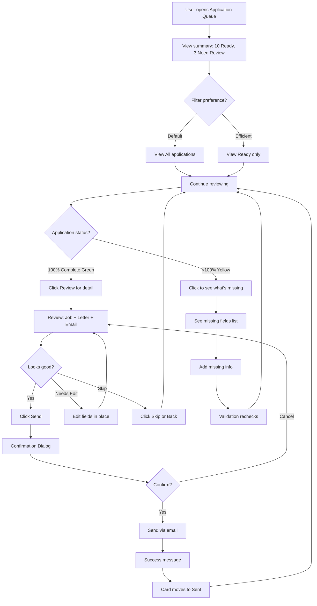
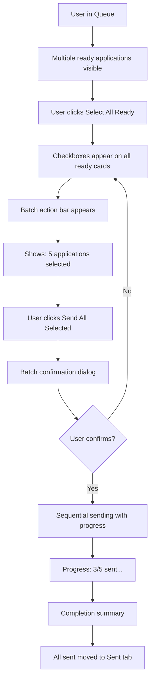
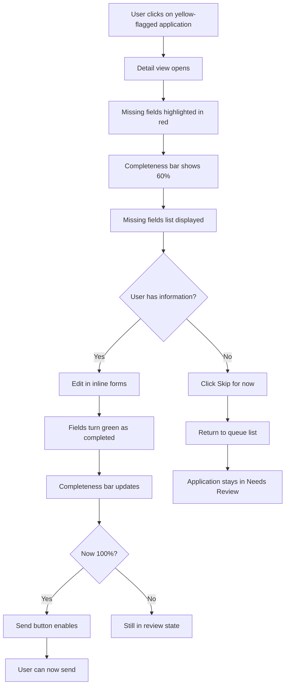

# JobSearchAI UX/UI Specification
**Application Queue Dashboard**

_Generated on 2025-10-15 by Claudio_

## Executive Summary

This UX specification defines the user experience and interface design for the Application Queue Dashboard - the central interface where users review AI-generated job applications before sending. This is one of three critical MVP features completing the JobSearchAI automation pipeline.

**Context**: JobSearchAI automates job application generation but maintains human-in-the-loop quality control. The Application Queue is where users spend 15-30 minutes each morning reviewing generated applications, ensuring quality, and approving sends. The UX must optimize for **efficiency** (review many applications quickly), **confidence** (trust in application quality), and **control** (easy editing and selective sending).

**Target Outcome**: Transform what would be 30-45 minutes of manual work per application into 2-3 minutes of focused review time, while maintaining professional quality and giving users complete control.

---

## 1. UX Goals and Principles

### 1.1 Target User Personas

**Primary Persona: "Passive Explorer" Claudio**

- **Demographics**: Technical professional, currently employed, exploring better opportunities
- **Goals**: Find better job without making job search a second full-time job
- **Behavior**: Morning routine person - wants to review applications over coffee, not spend hours
- **Pain Points**: 
  - Decision fatigue from repetitive manual work
  - Fear of sending subpar applications
  - Uncertainty about application completeness
  - Context-switching between multiple tools
- **Success Criteria**: 
  - Review 10+ applications in under 30 minutes
  - Confident every sent application is professional quality
  - No accidentally sending incomplete applications
  - Clear sense of progress and accomplishment

**User Mindset When Using Queue**:
- "Show me what's ready to send"
- "Let me quickly spot any issues"
- "Make sending as frictionless as possible once I'm confident"
- "Don't let me send something incomplete by accident"

### 1.2 Usability Goals

**Primary Goals:**
1. **Scanning Efficiency**: User can visually scan 10-20 applications in under 60 seconds to identify which need attention
2. **Quick Decision Making**: From queue view to "Send" decision in under 2 minutes per ready application
3. **Error Prevention**: Impossible to send incomplete or invalid applications (validation as guardrail)
4. **Confidence Building**: Clear visual indicators build trust that AI-generated content is professional quality

**Secondary Goals:**
5. **Batch Operation Support**: Ability to send multiple ready applications efficiently ("Send All Ready")
6. **Flexible Workflow**: Support both review-then-send and send-immediately patterns
7. **Progress Visibility**: Clear indication of completion status and what remains
8. **Low Cognitive Load**: Minimal decisions required, obvious next actions

### 1.3 Design Principles

**1. Clarity Over Cleverness**
- Every status and action must be immediately obvious
- No hidden states or unclear indicators
- Error messages provide specific, actionable guidance

**2. Confidence Through Transparency**
- Show complete application preview before send
- Display validation results prominently
- Make completeness percentage visual and intuitive

**3. Efficiency Through Smart Defaults**
- Ready applications float to top
- Most common action (Send) is primary button
- Batch operations for power users

**4. Safety First, Speed Second**
- Confirmation required for irreversible actions
- Invalid applications physically cannot be sent
- Explicit user approval required (no auto-send)

**5. Progressive Disclosure**
- Summary view for scanning
- Detail view for thorough review
- Full content available but not overwhelming

---

## 2. Information Architecture

### 2.1 Site Map

```
Dashboard (existing)
└── Application Queue (NEW)
    ├── All Applications View (default)
    ├── Ready to Send Filter
    ├── Needs Review Filter
    ├── Sent Archive Filter
    └── Application Detail Modal
        ├── Job Information Tab
        ├── Generated Letter Tab
        ├── Email Preview Tab
        └── Edit Fields Section
```

**Navigation Context**:
- Queue accessible from main dashboard navigation
- Badge indicator showing number of ready applications
- Direct link: `/queue`

### 2.2 Navigation Structure

**Primary Navigation**:
- Main Dashboard
- **Application Queue** ← NEW (with badge count)
- Job Matcher (existing)
- CV Manager (existing)
- Settings

**Secondary Navigation (within Queue)**:
- Tab/Filter buttons: All | Ready | Needs Review | Sent
- Batch action bar (appears when selections made)

**Breadcrumb**: Dashboard > Application Queue

---

## 3. User Flows

### 3.1 Core Flow: Morning Application Review



**Entry Points**:
- From dashboard: "X applications ready" notification/card
- Direct URL: http://localhost:5000/queue
- After scraper completes: Navigate to queue

**Success Criteria**:
- All ready applications reviewed and sent
- No incomplete applications accidentally sent
- User feels confident in quality

**Edge Cases**:
- No applications in queue → Friendly empty state
- All applications need review → Guidance on what to do first
- Email send fails → Clear error with retry option

### 3.2 Flow: Batch Send Multiple Applications



**Key Decision Point**: Batch send is for power users who've already done initial review. Confirmation must be clear that multiple applications will be sent.

### 3.3 Flow: Handling Incomplete Application



**Critical UX Elements**:
- Clear visual distinction between missing vs. present fields
- Real-time validation feedback as user types
- Completeness bar provides progress motivation
- Send button physically disabled until 100%

---

## 4. Component Library and Design System

### 4.1 Design System Approach

**Strategy**: Leverage existing Flask application's Bootstrap 5 foundation with custom components for application-specific needs.

**Rationale**:
- Bootstrap 5 already in use (existing dashboard)
- Provides responsive grid, form elements, modals
- Custom CSS for application cards, status badges, validation indicators
- Consistent with existing application aesthetic

**Component Philosophy**: 
- Card-based layout for scannable queue
- Progressive disclosure (summary → detail)
- Clear status indicators (color + icon + text)
- Inline editing where possible

### 4.2 Core Components

#### Component: Application Card

**Purpose**: Display application summary in queue list view

**Variants**:
- Ready to Send (green border, checkmark icon)
- Needs Review (yellow border, warning icon)
- Sent (gray, archive icon)

**States**:
- Default (not selected)
- Hover (subtle elevation)
- Selected (checkbox checked, highlight)
- Sending (loading spinner, disabled)

**Content Structure**:
```
┌─────────────────────────────────────────┐
│ [Status Badge] Company Name             │
│ Job Title                               │
│ ──────────────────────────────────────  │
│ [Completeness Bar] 100%                 │
│ ──────────────────────────────────────  │
│ Preview: "Sehr geehrte Damen und..."   │
│ ──────────────────────────────────────  │
│ [Review Button] [Send Button]          │
└─────────────────────────────────────────┘
```

**Accessibility**: 
- Semantic HTML (article element)
- ARIA labels for status
- Keyboard navigation support
- Color + icon + text for status (not color alone)

#### Component: Completeness Indicator

**Purpose**: Show validation status and percentage complete

**Visual Design**:
- Progress bar (Bootstrap)
- Color-coded: Red (0-60%), Yellow (61-99%), Green (100%)
- Percentage text overlay
- Icon: ✗ (incomplete), ✓ (complete)

**Interactive States**:
- Updates in real-time as fields edited
- Smooth animation on percentage change
- Tooltip on hover showing missing fields

#### Component: Status Badge

**Purpose**: Quick visual indicator of application state

**Variants**:
```
✅ Ready     → Green badge, checkmark icon
⚠️  Review   → Yellow badge, exclamation icon  
📧 Sent      → Gray badge, envelope icon
❌ Invalid   → Red badge, X icon (rare, validation failed)
```

**Size**: Small (16px height), fits inline with text

#### Component: Application Detail Modal

**Purpose**: Full application review interface

**Structure**:
```
┌────────────────────────────────────────────┐
│ [×] Application Detail                      │
├────────────────────────────────────────────┤
│ Tabs: [Job Info] [Bewerbung] [Email]      │
├────────────────────────────────────────────┤
│                                            │
│ [Tab Content Area]                         │
│                                            │
│ (Job info OR Generated letter OR Email)   │
│                                            │
├────────────────────────────────────────────┤
│ [Completeness: ████████░░ 80%]            │
│                                            │
│ Missing: recipient_email, company_name     │
├────────────────────────────────────────────┤
│           [Skip]  [Edit]  [Send]          │
└────────────────────────────────────────────┘
```

**Tab Content**:
1. **Job Info**: Company, title, description, URL
2. **Bewerbung**: Full AI-generated cover letter
3. **Email**: Preview of how email will appear

**Edit Mode**: Inline forms appear at bottom of modal for missing/editable fields

#### Component: Confirmation Dialog

**Purpose**: Prevent accidental sends

**Variants**:
- Single send confirmation
- Batch send confirmation (shows count)

**Content**:
```
┌─────────────────────────────────────────┐
│ Confirm Send Application                 │
├─────────────────────────────────────────┤
│ Send application to:                     │
│ hr@company.ch                           │
│                                         │
│ For position:                           │
│ Senior Python Developer                 │
│                                         │
│ This action cannot be undone.           │
├─────────────────────────────────────────┤
│        [Cancel]    [Send Application]   │
└─────────────────────────────────────────┘
```

**Primary action**: Styled as primary button (blue)
**Secondary action**: Styled as secondary/outline

#### Component: Batch Action Bar

**Purpose**: Multi-select operations

**Appears**: When one or more applications selected

**Position**: Sticky bottom bar

**Content**:
```
┌─────────────────────────────────────────────────────┐
│ 5 applications selected  [Send All] [Deselect All] │
└─────────────────────────────────────────────────────┘
```

**States**:
- Slides in from bottom when selections made
- Shows count dynamically
- Hides when all deselected

---

## 5. Visual Design Foundation

### 5.1 Color Palette

**Semantic Colors** (building on existing Bootstrap theme):

**Status Colors**:
```
Success Green:   #28a745  (Ready to send, 100% complete)
Warning Yellow:  #ffc107  (Needs review, 61-99%)
Danger Red:      #dc3545  (Incomplete, validation errors, 0-60%)
Info Blue:       #17a2b8  (Informational messages)
Neutral Gray:    #6c757d  (Sent/archived applications)
```

**Background Colors**:
```
Page Background:     #f8f9fa  (Light gray)
Card Background:     #ffffff  (White)
Card Hover:          #f1f3f5  (Subtle hover state)
Selected Card:       #e3f2fd  (Light blue tint)
```

**Text Colors**:
```
Primary Text:        #212529  (Dark gray, high contrast)
Secondary Text:      #6c757d  (Medium gray, metadata)
Link Text:           #007bff  (Bootstrap primary blue)
Error Text:          #dc3545  (Red for validation errors)
```

**Borders**:
```
Default Border:      #dee2e6  (Light gray)
Success Border:      #28a745  (Green for ready cards)
Warning Border:      #ffc107  (Yellow for needs review)
```

### 5.2 Typography

**Font Families**:
```css
Primary: -apple-system, BlinkMacSystemFont, "Segoe UI", Roboto, 
         "Helvetica Neue", Arial, sans-serif
Monospace: SFMono-Regular, Menlo, Monaco, Consolas, 
           "Liberation Mono", "Courier New", monospace
```

**Type Scale** (rem-based):
```
h1: 2.5rem (40px)   - Page title "Application Queue"
h2: 2rem (32px)     - Section headers
h3: 1.75rem (28px)  - Card section titles
h4: 1.5rem (24px)   - Modal titles
h5: 1.25rem (20px)  - Subsection headers
h6: 1rem (16px)     - Small headers

Body: 1rem (16px)   - Primary content
Small: 0.875rem (14px) - Metadata, secondary info
Tiny: 0.75rem (12px) - Labels, helper text
```

**Font Weights**:
```
Light:   300  (Not used)
Regular: 400  (Body text)
Medium:  500  (Emphasis, card titles)
Bold:    700  (Headers, important info)
```

### 5.3 Spacing and Layout

**Grid System**: Bootstrap 5's 12-column responsive grid

**Container Widths**:
- Desktop (>1200px): Max-width 1140px
- Tablet (768-1199px): Max-width 960px
- Mobile (<768px): Full width with 15px padding

**Spacing Scale** (rem-based, Bootstrap utilities):
```
0.25rem (4px)   - Tiny gaps
0.5rem (8px)    - Small spacing
0.75rem (12px)  - Compact layouts
1rem (16px)     - Standard spacing
1.5rem (24px)   - Section spacing
2rem (32px)     - Large gaps
3rem (48px)     - Major section breaks
```

**Card Layout**:
```
Card Grid: 3 columns on desktop, 2 on tablet, 1 on mobile
Card Spacing: 1.5rem (24px) gap between cards
Card Padding: 1.5rem (24px) internal padding
Card Border Radius: 0.5rem (8px) rounded corners
```

**Application Card Specifications**:
```
Min Height: 200px (ensures consistent grid)
Max Height: 400px (prevents overly tall cards)
Shadow: 0 2px 4px rgba(0,0,0,0.1) default
Shadow Hover: 0 4px 8px rgba(0,0,0,0.15)
Border: 2px solid (colored by status)
```

---

## 6. Responsive Design

### 6.1 Breakpoints

```css
/* Mobile First Approach */
xs: 0px      - Extra small devices (portrait phones)
sm: 576px    - Small devices (landscape phones)
md: 768px    - Medium devices (tablets)
lg: 992px    - Large devices (desktops)
xl: 1200px   - Extra large devices (large desktops)
```

**Key Breakpoint Behavior**:
- **Mobile (<768px)**: Single column cards, stacked buttons, simplified modals
- **Tablet (768-991px)**: 2-column card grid, responsive modals
- **Desktop (≥992px)**: 3-column card grid, full-width modals with sidebars

### 6.2 Adaptation Patterns

**Card Grid Adaptation**:
```
Desktop (≥992px):  3 columns
Tablet (768-991px): 2 columns
Mobile (<768px):   1 column
```

**Application Detail Modal**:
- **Desktop**: Large modal (800px wide), tabbed interface
- **Tablet**: Medium modal (90% width), tabbed interface
- **Mobile**: Full-screen modal, vertical tabs become dropdown/accordion

**Action Buttons**:
- **Desktop**: Inline buttons within card footer
- **Mobile**: Full-width stacked buttons for easier touch targets

**Batch Action Bar**:
- **Desktop**: Sticky bottom, shows all actions inline
- **Mobile**: Simplified to show count + primary action only

**Font Sizes** (mobile adjustments):
- Reduce h1-h3 sizes by 20% on mobile
- Keep body text 16px (readability)
- Increase button text to 18px on mobile (touch target)

---

## 7. Accessibility

### 7.1 Compliance Target

**Target**: WCAG 2.1 Level AA compliance

**Rationale**: 
- Level AA is industry standard for web applications
- Ensures usable by most users with disabilities
- Critical for professional application (Swiss market expectations)

### 7.2 Key Requirements

**Keyboard Navigation**:
- All interactive elements accessible via Tab
- Modal traps focus when open, Esc to close
- Cards navigable with arrow keys
- Enter/Space to activate buttons

**Screen Reader Support**:
- Semantic HTML elements (nav, main, article, button)
- ARIA labels for status badges
- ARIA live regions for validation feedback
- Descriptive link text (no "click here")

**Visual Accessibility**:
- Color contrast ratio ≥4.5:1 for text
- Status indicated by color + icon + text (not color alone)
- Focus indicators visible (2px blue outline)
- Text resizable to 200% without layout breaking

**Form Accessibility**:
- Labels associated with inputs
- Error messages linked via aria-describedby
- Required fields indicated visually and semantically
- Inline validation provides immediate feedback

**Touch Targets** (mobile):
- Minimum 44x44px touch target size
- Adequate spacing between interactive elements
- No reliance on hover for functionality

---

## 8. Interaction and Motion

### 8.1 Motion Principles

**Principle 1: Purposeful Motion**
- Animations guide user attention
- Reinforce state changes
- Never purely decorative

**Principle 2: Speed and Easing**
- Fast interactions (<200ms) feel responsive
- Slow interactions (>500ms) feel sluggish
- Use ease-out for entering elements (start fast, slow down)
- Use ease-in for exiting elements (start slow, speed up)

**Principle 3: Respect User Preferences**
- Honor prefers-reduced-motion media query
- Provide option to disable animations in settings

### 8.2 Key Animations

**Card Hover State**:
```css
transition: all 0.2s ease-out;
/* Elevation increases on hover */
box-shadow: 0 4px 8px rgba(0,0,0,0.15);
transform: translateY(-2px);
```

**Status Change**:
```css
/* Completeness bar fills smoothly */
transition: width 0.3s ease-out;

/* Status badge color changes */
transition: background-color 0.2s ease-out;
```

**Modal Entry/Exit**:
```css
/* Modal fades in */
.modal-enter {
  opacity: 0;
  transform: scale(0.95);
}
.modal-enter-active {
  opacity: 1;
  transform: scale(1);
  transition: all 0.2s ease-out;
}

/* Modal fades out */
.modal-exit {
  opacity: 1;
}
.modal-exit-active {
  opacity: 0;
  transform: scale(0.95);
  transition: all 0.15s ease-in;
}
```

**Send Success**:
```css
/* Card slides out smoothly when sent */
@keyframes slideOut {
  from { opacity: 1; transform: translateX(0); }
  to { opacity: 0; transform: translateX(100%); }
}
.sending-success {
  animation: slideOut 0.3s ease-out forwards;
}
```

**Loading States**:
```css
/* Spinner for sending state */
@keyframes spin {
  from { transform: rotate(0deg); }
  to { transform: rotate(360deg); }
}
.spinner {
  animation: spin 0.6s linear infinite;
}
```

**Batch Action Bar Slide-in**:
```css
transition: transform 0.3s ease-out;
transform: translateY(100%); /* Hidden below viewport */
.visible {
  transform: translateY(0); /* Slides up */
}
```

---

## 9. Design Files and Wireframes

### 9.1 Design Files

**Approach**: Direct development from this specification + tech spec

**Rationale**: 
- Level 1 project (small feature scope)
- Internal tool (no external stakeholders requiring mockups)
- Leveraging existing Bootstrap components reduces design complexity
- Tech spec already provides detailed UI structure

**For Future Phases**:
- Consider Figma mockups for complex flows post-MVP
- Create component library in Storybook if building more features

### 9.2 Key Screen Layouts

#### Screen Layout: Application Queue Dashboard (Default View)

**Page Structure**:
```
┌─────────────────────────────────────────────────────────────┐
│ [Header: Logo | Navigation | User]                          │
├─────────────────────────────────────────────────────────────┤
│ Application Queue                                           │
│ ─────────────────────────────────────────────────────────   │
│ Summary: 10 Ready to Send | 3 Need Review | 15 Sent        │
│                                                             │
│ [All] [Ready] [Needs Review] [Sent]                        │
│ ─────────────────────────────────────────────────────────   │
│                                                             │
│ ┌─────────────┐ ┌─────────────┐ ┌─────────────┐          │
│ │ ✅ Ready    │ │ ✅ Ready    │ │ ⚠️  Review  │          │
│ │ TechCorp AG │ │ StartupXYZ  │ │ BigCo Inc   │          │
│ │ Sr Dev      │ │ Engineer    │ │ Developer   │          │
│ │ ████████ 100│ │ ████████ 100│ │ ██████░░ 75 │          │
│ │ Preview...  │ │ Preview...  │ │ Preview...  │          │
│ │ [Review][Send]│ │ [Review][Send]│ │ [Review]    │          │
│ └─────────────┘ └─────────────┘ └─────────────┘          │
│                                                             │
│ ┌─────────────┐ ┌─────────────┐ ┌─────────────┐          │
│ │ ✅ Ready    │ │ ⚠️  Review  │ │ 📧 Sent     │          │
│ │ ...         │ │ ...         │ │ ...         │          │
│ └─────────────┘ └─────────────┘ └─────────────┘          │
│                                                             │
└─────────────────────────────────────────────────────────────┘
```

**Key Elements**:
1. **Header**: Standard site navigation (existing)
2. **Summary Bar**: Count of applications by status
3. **Filter Tabs**: Quick access to filtered views
4. **Card Grid**: 3-column responsive grid of application cards
5. **Batch Action Bar**: Appears when selections made (not shown)

**Empty State** (no applications):
```
┌─────────────────────────────────────────────────┐
│            No Applications in Queue             │
│                                                 │
│          [Illustration: Empty inbox]            │
│                                                 │
│  Your application queue is empty.               │
│  Run a job scrape to generate new applications. │
│                                                 │
│           [Run Job Scraper]                     │
└─────────────────────────────────────────────────┘
```

#### Screen Layout: Application Detail Modal

**Modal Structure** (desktop, 800px wide):
```
┌───────────────────────────────────────────────────────────┐
│ Application: Senior Python Developer at TechCorp AG   [×] │
├───────────────────────────────────────────────────────────┤
│                                                           │
│ Tabs: [Job Info] [Bewerbung] [Email Preview]            │
│ ─────────────────────────────────────────────────────────│
│                                                           │
│ JOB INFORMATION                                          │
│                                                           │
│ Company: TechCorp AG                                     │
│ Position: Senior Python Developer                        │
│ Location: Zürich, Switzerland                            │
│ Job URL: https://ostjob.ch/job/12345                    │
│                                                           │
│ Description:                                             │
│ [Full job description text, scrollable if long]         │
│                                                           │
│ ─────────────────────────────────────────────────────────│
│                                                           │
│ COMPLETENESS STATUS                                      │
│ [████████████████████░] 95%                             │
│                                                           │
│ Missing: recipient_name                                  │
│ Warnings: Job URL not found (optional)                   │
│                                                           │
├───────────────────────────────────────────────────────────┤
│              [Skip]    [Edit Fields]    [Send]           │
└───────────────────────────────────────────────────────────┘
```

**Tab 2: Bewerbung Tab**:
Shows full AI-generated German-language cover letter, formatted professionally

**Tab 3: Email Preview Tab**:
Shows exactly how email will appear:
- To: hr@techcorp.ch
- Subject: Bewerbung als Senior Python Developer bei TechCorp AG
- Body: [Full letter preview]

**Edit Mode** (bottom section expands):
```
┌───────────────────────────────────────────────────────────┐
│ EDIT FIELDS                                               │
│                                                           │
│ Recipient Email: [hr@techcorp.ch        ]               │
│ Recipient Name:  [HR Department         ]               │
│ Company Name:    [TechCorp AG           ]               │
│                                                           │
│           [Cancel]    [Save Changes]                     │
└───────────────────────────────────────────────────────────┘
```

Fields update validation in real-time as user types.

#### Screen Layout: Mobile Application Queue

**Mobile Layout** (single column, <768px):
```
┌─────────────────────────────┐
│ [☰] Application Queue  [👤] │
├─────────────────────────────┤
│ 10 Ready | 3 Review | 15 Sent│
│                             │
│ [All▼] [Ready▼] [Review▼] │
├─────────────────────────────┤
│ ┌─────────────────────────┐ │
│ │ ✅ Ready to Send        │ │
│ │ TechCorp AG             │ │
│ │ Senior Python Developer │ │
│ │ [████████] 100%        │ │
│ │ "Sehr geehrte..."      │ │
│ │                         │ │
│ │ [Review Details]        │ │
│ │ [Send Application]      │ │
│ └─────────────────────────┘ │
│                             │
│ ┌─────────────────────────┐ │
│ │ ⚠️  Needs Review        │ │
│ │ BigCo Inc               │ │
│ │ Software Engineer       │ │
│ │ [██████░░] 75%         │ │
│ │ Missing: email         │ │
│ │                         │ │
│ │ [Complete Application]  │ │
│ └─────────────────────────┘ │
│                             │
└─────────────────────────────┘
```

**Mobile Changes**:
- Hamburger menu for main navigation
- Summary as compact bar
- Filters become dropdown selectors
- Cards stack vertically (100% width)
- Full-width buttons for touch targets
- Modal becomes full-screen on mobile

---

## 10. Next Steps

### 10.1 Immediate Actions

**For Development Team (Claudio)**:

1. **Implement Application Queue Routes** (4-6 hours)
   - Create Flask blueprint: `blueprints/application_queue_routes.py`
   - Register blueprint in `dashboard.py`
   - Implement routes: `/queue`, `/queue/send/<id>`, `/queue/send-batch`

2. **Create HTML Templates** (2-3 hours)
   - `templates/application_queue.html` - Main queue dashboard
   - `templates/application_detail.html` - Modal content
   - Leverage Bootstrap 5 components
   - Implement responsive grid for cards

3. **Develop JavaScript Interactions** (2 hours)
   - `static/js/queue.js` - AJAX interactions
   - Modal opening/closing
   - Confirmation dialogs
   - Real-time validation updates
   - Batch selection logic

4. **Style Custom Components** (1-2 hours)
   - `static/css/queue_styles.css` - Custom styling
   - Application cards with status colors
   - Completeness progress bars
   - Status badges
   - Responsive adjustments

5. **Integration Testing** (1 hour)
   - Test complete user flow end-to-end
   - Verify responsive behavior on mobile/tablet/desktop
   - Test accessibility with keyboard and screen reader
   - Verify email sending works correctly

**For UX Validation**:
- Run usability test with sample applications
- Verify 15-30 minute review time achieved
- Ensure no incomplete applications can be sent
- Confirm all states and error conditions handled

### 10.2 Design Handoff Checklist

- [x] All user flows documented
- [x] Component inventory complete
- [x] Accessibility requirements defined
- [x] Responsive strategy clear
- [x] Design system approach documented
- [x] Visual design foundation established
- [x] Key screen layouts described
- [x] Interaction patterns specified
- [ ] Ready for implementation (awaiting tech spec review)
- [ ] Component implementation order defined in stories
- [ ] MVP scope boundaries clear

**Ready for Development**: This UX specification provides complete design guidance for implementing the Application Queue UI. Combined with the technical specification (`docs/tech-spec.md`), developers have all information needed to build the feature.

**Next Steps**:
1. Review UX spec with tech spec for alignment
2. Generate implementation stories (Epic + 2-3 stories)
3. Begin development with Story 1: Email Sender Module
4. Implement UI components following this specification

---

## Appendix

### Related Documents

- Product Brief: `docs/product-brief-JobSearchAI-2025-10-15.md`
- Tech Spec: `docs/tech-spec.md`
- Workflow Status: `docs/bmm-workflow-status.md`
- Brainstorming Results: `docs/brainstorming-session-results-2025-10-15.md`

### Version History

| Date       | Version | Changes               | Author  |
| ---------- | ------- | --------------------- | ------- |
| 2025-10-15 | 1.0     | Initial specification | Claudio |

---

_This UX specification is part of the BMM (BMad Method) Level 1 planning workflow. It defines the user experience and interface design for the Application Queue Dashboard feature of JobSearchAI._
